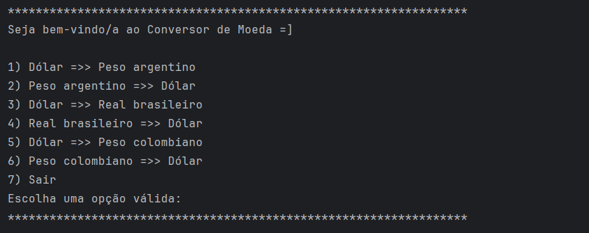
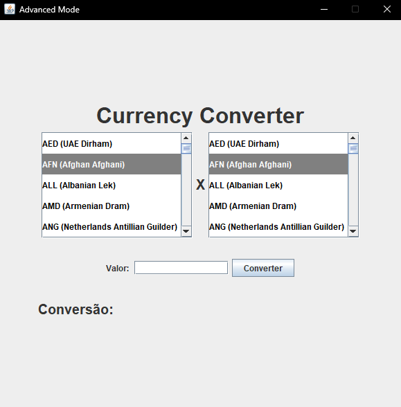

# 💱 Conversor de Moeda


* [Descrição do Projeto](#descrição-do-projeto)
* [Status do Projeto](#status-do-Projeto)
* [Funcionalidades](#funcionalidades)
* [Acesso ao Projeto](#acesso-ao-projeto)
* [Tecnologias utilizadas](#tecnologias-utilizadas)

## 📌 Descrição do Projeto
Este projeto é um conversor de moedas desenvolvido em **Java**, utilizando as bibliotecas **Gson** para manipulação de JSON, **Dotenv** para gerenciar variáveis de ambiente, e a **API ExchangeRate** para obter as taxas de câmbio em tempo real.

Ele possui duas interfaces:
- **Interface Console**: com um menu interativo e opções predefinidas para conversão entre moedas.
- **Interface Gráfica (Swing)**: com uma interface amigável para interações com o usuário.
---
## 🚧 Status do Projeto
✅ Projeto finalizado  
📌 Possíveis melhorias: suporte a mais moedas, temas personalizados no Swing, deploy como `.jar` executável.

---
## 🧩 Funcionalidades (Console 🔳)
- Conversão de Dólar para Peso Argentino, Real Brasileiro e Peso Colombiano
- Conversão inversa para Dólar
- Interface de linha de comando simples e funcional
- Consumo de API externa para taxa de câmbio em tempo real
- Validação de entrada de dados

## 🧩 Funcionalidades (Desktop 💻)
- Conversão diversificada
- Interface gráfica com Java Swing
- Consumo de API externa para taxa de câmbio em tempo real

---
## 🖥️ Demonstração

### Interface Console


### Interface Swing


---
## 🐦‍⬛ Acesso ao Projeto
 Clone o repositório:

```bash
git clone https://github.com/damatomos/currency-converter.git
```
Abra em uma IDE com suporte ao java e modifique como desejar.

## 🩻 Tecnologias utilizadas
* Java 21
* GSON
* Dotenv (dotenv-java)
* ExchangeRate API
* Java Swing (interface gráfica)